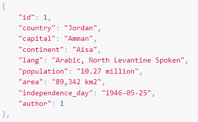
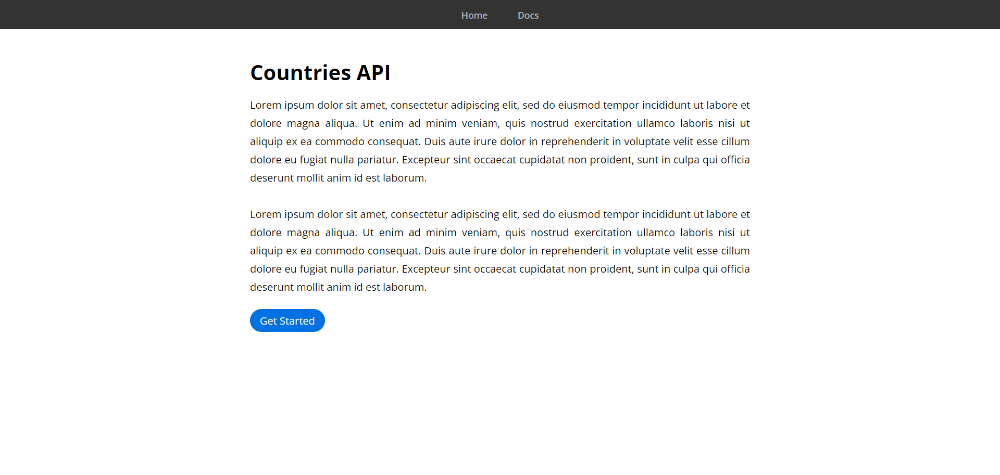
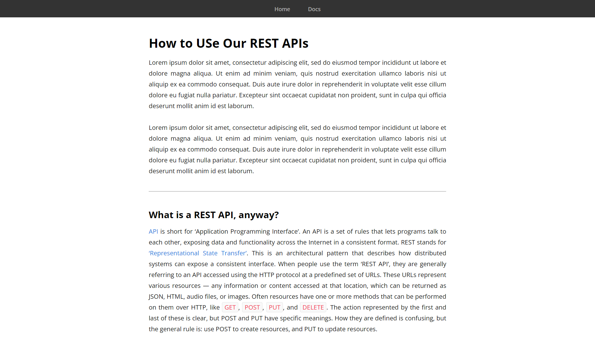
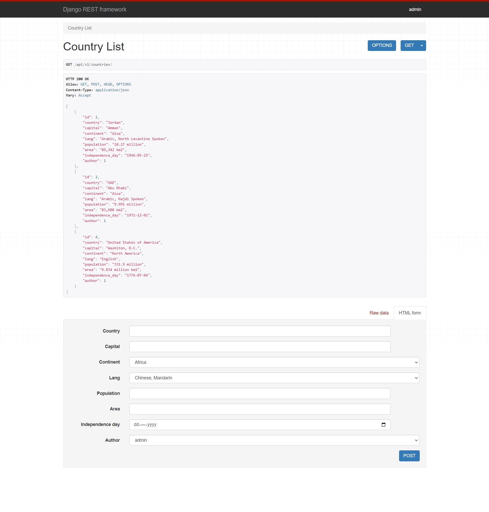
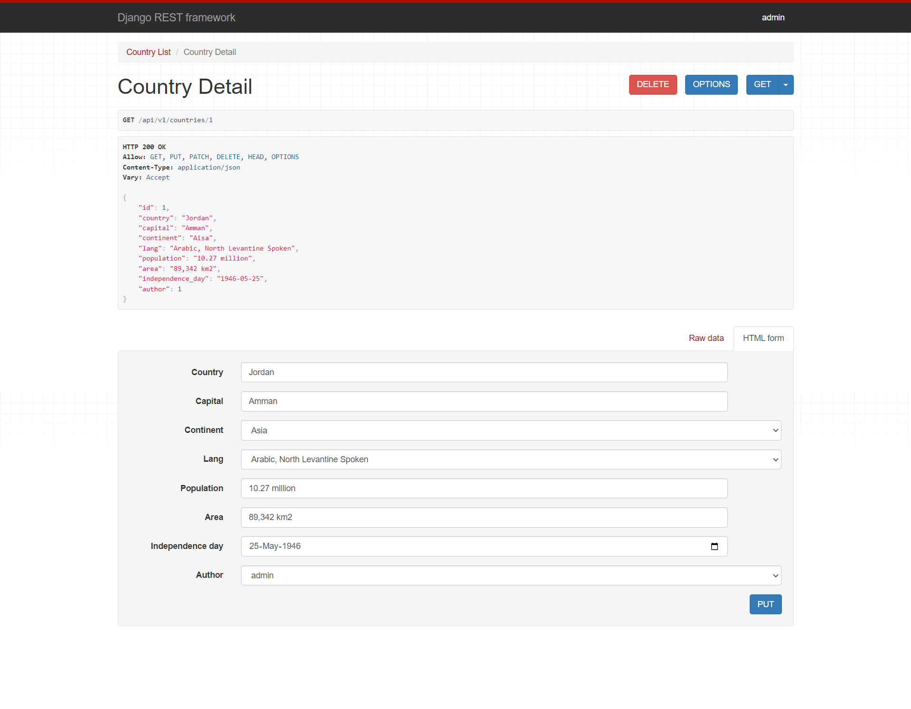

# drf-api

## Project: 

Countries REST API

## Author(s): 

Yazan Alfarra

## Project Description

This is a REST API where you can send GET, POST, PUT, PATCH and DELETE HTTP requests, to get, update or delete a countries details. 

**Response Example**



## Login to the admin pannel

- **Username:** admin
- **Password:** 0000

## Installing the requirements

```
$ pip install -r requirements.txt
```

## Running the server

```
$ python manage.py runserver
```
 
## Program Output

**Home Page**



**Docs Page**



**GET/POST Routes**



**Details/PUT/PATCH/DELETE Routes**

